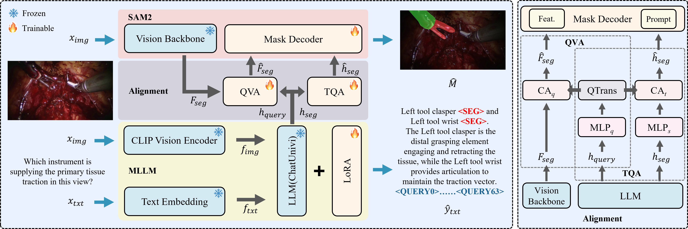

# SIRA

Official implementation of **SIRA: Reasoning-Aware Surgical Instrument Segmentation via Query-Anchored Alignment**.

[](LICENSE)
[](https://www.python.org/)
[](https://pytorch.org/)
[](https://huggingface.co/datasets/linxir226/SurgRS)
[](https://huggingface.co/linxir226/SIRA)

**Surgical instrument segmentation (SIS)** plays a critical role in robotic assistance and surgical workflow analysis. However, most existing SIS methods formulate segmentation as a category-driven localization problem, limiting their ability to capture procedural context and task-dependent semantics in surgical workflows. We introduce **Reasoning-Aware Surgical Instrument Segmentation (RA-SIS)**, a task formulation that frames segmentation as query-conditioned inference under surgical context. To benchmark this setting, we construct **SurgRS**, a surgical reasoning segmentation dataset consisting of 41,000 image-text pairs, which aligns instance-level masks with structured query-answer supervision to enable semantic grounding at the pixel level. Based on SurgRS, we propose **Surgical Instrument Reasoning and Segmentation Assistant (SIRA)**, a multimodal framework that disentangles target-level and query-level semantics and integrates them with visual features through **query-anchored dual alignment**. By aligning query semantics with spatial features and segmentation prompts, SIRA enhances semantic-visual consistency in mask prediction. Extensive experiments on SurgRS demonstrate improvements over existing reasoning-aware baselines.

## <span>&#x1F525;</span> Overview

<p align="center">
  
</p>

## <span>&#x1F6E0;&#xFE0F;</span> Installation

We use Python 3.11, PyTorch 2.6.0, and CUDA 12.4.

```bash
conda create -n sira python=3.11 -y
conda activate sira

git clone https://github.com/linxir226/SIRA.git
cd SIRA
```

Install PyTorch matching your local CUDA version first. The command below is for CUDA 12.4; for other CUDA versions, follow the [official PyTorch installation guide](https://pytorch.org/get-started/locally/).

```bash
pip install torch==2.6.0 torchvision==0.21.0 \
  --index-url https://download.pytorch.org/whl/cu124

pip install -r requirements.txt
pip install -e . --no-deps
```

`pip install -e .` compiles the SAM 2 CUDA extension. A working CUDA toolkit and compiler are therefore required.

## <span>&#x1F4E6;</span> Pretrained Models

SIRA requires three upstream pretrained components.

| Component | Configuration key | Purpose |
| --- | --- | --- |
| [Chat-UniVi-7B](https://huggingface.co/Chat-UniVi/Chat-UniVi) | `CHATUNIVI_MODEL_PATH` | Multimodal language model initialization |
| [CLIP ViT-L/14](https://huggingface.co/openai/clip-vit-large-patch14) | `CLIP_MODEL_PATH` | Chat-UniVi visual encoder |
| [SAM 2 Hiera Large](https://github.com/facebookresearch/sam2) | `SAM2_CHECKPOINT` | Image encoder and mask decoder initialization |

Place the upstream models under `checkpoints/`:

```text
checkpoints/
├── chat-univi/
├── clip-vit-large-patch14/
└── sam2_hiera_large.pt
```

Alternative locations can be set in `scripts/config.sh` or passed through the corresponding environment variables.

## <span>&#x1F4CA;</span> Dataset

SurgRS is available on Hugging Face: [linxir226/SurgRS](https://huggingface.co/datasets/linxir226/SurgRS).

Set `DATA_ROOT` in `scripts/config.sh` to the directory containing SurgRS:

```bash
DATA_ROOT="/path/to/datasets"
```

The default SurgRS layout expected by the provided scripts is:

```text
$DATA_ROOT/
└── SurgRS/
    ├── instance_classes.json
    ├── surgrs_train.json
    ├── surgrs_valid.json
    ├── surgrs_valid_classified.json
    ├── train/
    └── valid/
```

## <span>&#x1F680;</span> Training

GPU IDs, port, experiment name, and output root are configured in `scripts/config.sh`. The default configuration uses GPUs 0 and 1 and writes training outputs to `./outputs/sira`. 

```bash
DATA_ROOT=/path/to/datasets OUTPUT_DIR=./outputs bash scripts/train.sh
```

A single-GPU run can be launched without editing the script, but `steps_per_epoch` should be doubled to keep the same number of processed samples per epoch as the two-GPU setting:

```bash
GPU_IDS=0 DATA_ROOT=/path/to/datasets OUTPUT_DIR=./outputs \
bash scripts/train.sh --steps_per_epoch 13000
```

The reported experiments use two RTX 3090 GPUs, a per-GPU batch size of 1, and no gradient accumulation. The script performs 6,500 distributed optimizer steps per epoch, corresponding to 13,000 processed samples per epoch across both GPUs.

### Training Checkpoints

Training outputs are written under `${OUTPUT_DIR}/${EXP_NAME}`:

```text
outputs/
└── <EXP_NAME>/
    ├── train.log
    ├── events.out.tfevents.*
    ├── meta_log_epoch*_giou*_ciou*_dice*.pth
    └── ckpt_model/
        ├── latest
        └── global_step*/
            ├── mp_rank_00_model_states.pt
            └── *_optim_states.pt
```

`ckpt_model/` is the complete DeepSpeed checkpoint directory and is the default format used by the provided training and inference scripts. The `meta_log_epoch*.pth` files only record epoch and metric information and cannot be used as model weights.

To convert a DeepSpeed checkpoint into a consolidated fp32 state dict, use the `zero_to_fp32.py` script inside the checkpoint directory:

```bash
python ./outputs/<EXP_NAME>/ckpt_model/zero_to_fp32.py \
  ./outputs/<EXP_NAME>/ckpt_model \
  ./outputs/<EXP_NAME>/pytorch_model.bin
```

The resulting `pytorch_model.bin` can be further merged with the LoRA adapters and saved in Hugging Face format:

```bash
python merge_lora_weights/merge_lora_weights.py \
  --version ./checkpoints/chat-univi \
  --vision_tower ./checkpoints/clip-vit-large-patch14 \
  --weight ./outputs/<EXP_NAME>/pytorch_model.bin \
  --save_path ./outputs/<EXP_NAME>/hf_model \
  --precision bf16
```

For normal evaluation with this repository, use `ckpt_model/` directly as `CHECKPOINT_PATH`; conversion is only needed when a consolidated or Hugging Face-style model export is required.

By default, the training code keeps the checkpoint with the best validation gIoU and replaces the previous `ckpt_model/` directory.

To resume training, pass the complete `ckpt_model/` directory:

```bash
DATA_ROOT=/path/to/datasets \
OUTPUT_DIR=./outputs \
bash scripts/train.sh --resume ./outputs/<EXP_NAME>/ckpt_model
```

## <span>&#x1F50D;</span> Inference

The released SIRA checkpoint is available at [linxir226/SIRA](https://huggingface.co/linxir226/SIRA).

After downloading, place the checkpoint directory under `checkpoints/sira/`:

```text
checkpoints/
└── sira/
    └── ckpt_model/
        ├── latest
        ├── zero_to_fp32.py
        └── global_step*/
```

Standard inference:

```bash
DATA_ROOT=/path/to/datasets \
CHECKPOINT_PATH=./checkpoints/sira/ckpt_model \
bash scripts/valid_inference.sh
```

`CHECKPOINT_PATH` must point to the DeepSpeed checkpoint directory containing `latest`, rather than to `global_step*`, `meta_log_epoch*.pth`, or an individual `.pt` file. 

Visualization is disabled by default. To save visual results, append `--vis_enable`; outputs are written to `${OUTPUT_DIR}/${EXP_NAME}/inference` or `${OUTPUT_DIR}/${EXP_NAME}/class_inference` by default. Validation uses the first GPU from `GPU_IDS` unless `EVAL_GPU_IDS` is set explicitly.

Inference with metrics grouped by reasoning-query type:

```bash
DATA_ROOT=/path/to/datasets \
CHECKPOINT_PATH=./checkpoints/sira/ckpt_model \
bash scripts/valid_inference_classes.sh
```

## <span>&#x1F31F;</span> Citation

```bibtex
@misc{zhang2026sira,
  title={SIRA: Reasoning-Aware Surgical Instrument Segmentation via Query-Anchored Alignment},
  author={Zhang, Zhibo and Wang, Qijie and Yan, Zengqiang},
  year={2026},
  url={https://github.com/linxir226/SIRA}
}
```

## <span>&#x1F4DD;</span> License

This project is released under the MIT License. See [LICENSE](LICENSE) for details.

## <span>&#x1F396;&#xFE0F;</span> Acknowledgements

This work is built upon [VRS-HQ](https://github.com/SitongGong/VRS-HQ), [Chat-UniVi](https://github.com/PKU-YuanGroup/Chat-UniVi), [VISA](https://github.com/cilinyan/VISA), and [SAM 2](https://github.com/facebookresearch/sam2). We sincerely thank the authors for their excellent contributions.

The retained or adapted components remain subject to their respective licenses.
